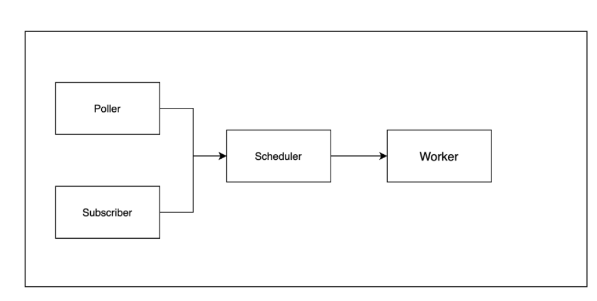
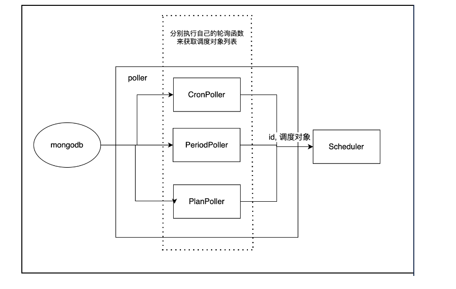
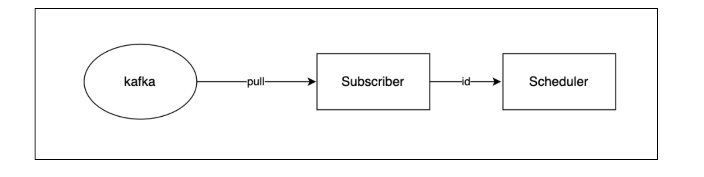
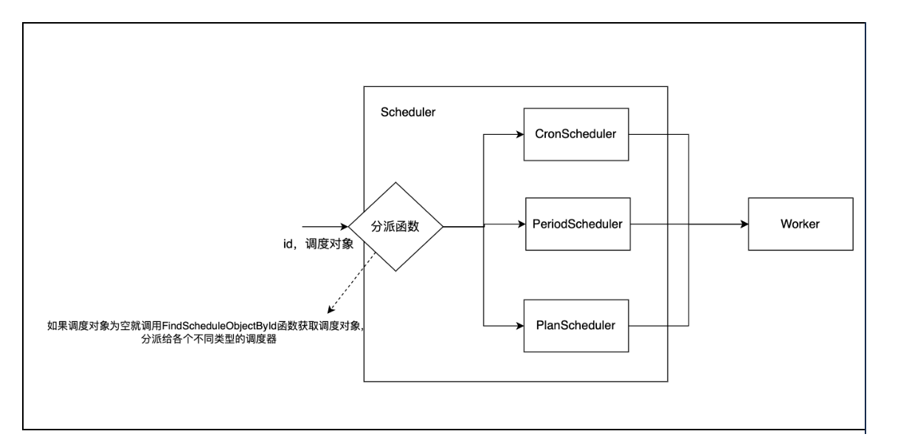
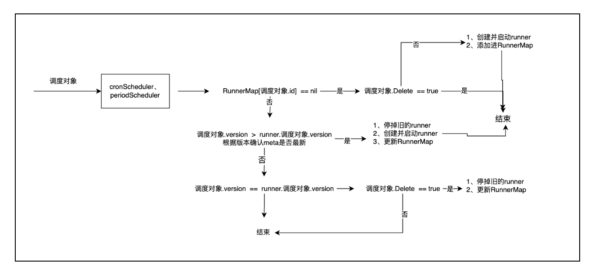
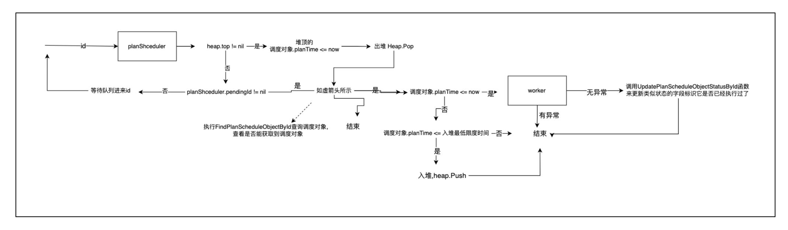

# little8-task
[](https://github.com/little-eight-china/little8-task)
[](https://www.apache.org/licenses/LICENSE-2.0.html)
[](https://img.shields.io/github/stars/little-eight-china/little8-task)
[](https://img.shields.io/github/forks/little-eight-china/little8-task)


## 简介
调度器-执行器的职责是获取调度对象，发给调度器去按照调度模式进行调度，最终给执行器执行相应逻辑。
整体由四个部分组成：

- Poller：定时从数据源获取调度对象列表，通过遍历把调度对象提交给Scheduler进行调度。
- Subscriber：监听指定主题的消息队列，把拉取到的id提交给Scheduler进行调度。
- Scheduler：处理接收的id，最终获取调度对象并提交给Worker。
- Worker：根据具体的调度对象来执行相应逻辑。



有三种调度模式：

- Cron：调度器根据cron表达式决定执行任务的时机。
- Period：调度器根据时间周期(比如每秒、每10分钟...)决定执行任务的时间。
- Plan：调度器根据指定的具体时间决定执行任务的时机，**只会执行一次**。
## 模块说明
### Poll模块
Poll模块分为：

- CronPoller：指定调度时间（默认每5分钟）调用FindCronScheduleObjects获取调度对象列表，通过遍历把id跟调度对象提交给Scheduler进行调度。
- PeriodPoller：指定调度时间（默认每5分钟）调用FindPeriodScheduleObjects获取调度对象列表，通过遍历把id跟调度对象提交给Scheduler进行调度。
- PlanPoller：指定调度时间（默认每5分钟）调用FindPlanScheduleObjects获取调度对象列表，通过遍历把id跟调度对象提交给Scheduler进行调度。




### Subscribe模块
Subcribe作为消息队列的消费者，会根据传入的订阅主题来不断从消息队列拉取相应的调度对象的id，然后把id提交给Scheduler进行调度。



### Scheduler模块
Scheduler作为调度器负责分派调度对象给不同的调度器处理，由下面组成：

- CronScheduler：处理调度模式为cron类型的调度对象，并最终提交到Worker进行处理。
- PeriodScheduler：处理调度模式为period类型的调度对象，并最终提交到Worker进行处理。
- PlanScheduler：处理调度模式为plan类型的调度对象，并最终提交到Worker进行处理。



#### CronScheduler、PeriodScheduler
2个调度器只是创建的runner类型不同，其代码逻辑基本一致。
维护一个重要的成员 runnerMap。顾名思义，它是一个map对象，key值为调度对象的id，value为CronRunner对象，用于存储每个调度对象对应的定时任务对象。
运作过程如下图：（比较简陋，但应该可以知道干了什么）



###### PlanScheduler
调度器维护三个重要成员：

- pendingId：监听到的id。
- ids：chan类型，会不断监听该成员，把获取到的id赋值给pendingId。
- scheduleObjectHeap：根据通知时间排序的最小堆。

因为plan类型的在不修改的情况下只会发一次，所以调用UpdatePlanHandledStatusById函数来更新类似状态的字段标识它是否已经执行过了。
运作过程如下图：（比较简陋，但应该可以知道干了什么）



### Worker模块
执行器会根据接收的调度对象，来执行Work函数来实现相应的逻辑。Work函数接收的是BaseScheduleObject对象，最终执行的是它的Do函数。
```go
func (worker *Worker) Work(scheduleObject scheduleriface.BaseScheduleObject) error {
    err := scheduleObject.Do(nil)
    if err != nil {
        worker.logger.Warn("WorkFailed",
         zap.Error(err),
        )
      return err
   }
       return nil
}
```
## 使用说明
调度对象必需实现BeseScheduleObject、BeseScheduleObjectManager接口的方法，其他的话根据自己所需的调度模式来实现对应的接口。

例子在test包下

### 定义的抽象接口
#### 调度对象抽象接口
定义BaseScheduleObject接口，获取调度对象的基础属性，基于此又定义三种调度模式的相应对象接口

- CronScheduleObject：cron类型的调度对象，处理调度时间
- PeriodScheduleObject：period类型的调度对象，处理调度时间
- PlanScheduleObject：plan类型的调度对象，处理调度时间
- PlanScheduleObjectHeapByTime：plan类型的调度需要的堆对象
```go
type BaseScheduleObject interface {
	GetId() string
	GetName() string
	GetScheduleMode() string
	GetVersion() int
	IsDeleted() bool
	Do(context.Context) error

	IsCronMode() (CronScheduleObject, bool)
	IsPeriodMode() (PeriodScheduleObject, bool)
	IsPlanMode() (PlanScheduleObject, bool)
}
type BaseScheduleObjects []BaseScheduleObject

type CronScheduleObject interface {
	BaseScheduleObject
	GetCronSpec() string
}

type CronScheduleObjects []CronScheduleObject

func (objects CronScheduleObjects) Append(others ...CronScheduleObject) CronScheduleObjects {
	return append(objects, others...)
}

type PeriodScheduleObject interface {
	BaseScheduleObject
	GetSchedulePeriod() time.Duration
}

type PeriodScheduleObjects []PeriodScheduleObject

func (objects PeriodScheduleObjects) Append(others ...PeriodScheduleObject) PeriodScheduleObjects {
	return append(objects, others...)
}

type PlanScheduleObject interface {
	BaseScheduleObject
	GetPlannedScheduleTime() time.Time
}

type PlanScheduleObjects []PlanScheduleObject

func (objects PlanScheduleObjects) Append(others ...PlanScheduleObject) PlanScheduleObjects {
	return append(objects, others...)
}

type PlanScheduleObjectHeapByTime PlanScheduleObjects

func (h PlanScheduleObjectHeapByTime) Native() PlanScheduleObjects {
	return PlanScheduleObjects(h)
}

func (h PlanScheduleObjectHeapByTime) Len() int {
	return len(h)
}

func (h PlanScheduleObjectHeapByTime) Less(i, j int) bool {
	return h[i].GetPlannedScheduleTime().Before(h[j].GetPlannedScheduleTime())
}

func (h PlanScheduleObjectHeapByTime) Swap(i, j int) {
	h[i], h[j] = h[j], h[i]
}

func (h *PlanScheduleObjectHeapByTime) Push(x interface{}) {
	*h = append(*h, x.(PlanScheduleObject))
}

func (h *PlanScheduleObjectHeapByTime) Pop() interface{} {
	old := *h
	n := len(old)
	x := old[n-1]
	*h = old[:n-1]
	return x
}

func (h PlanScheduleObjectHeapByTime) Empty() bool {
	return h.Len() == 0
}

func (h PlanScheduleObjectHeapByTime) Top() PlanScheduleObject {
	if h.Empty() {
		return nil
	}

	return h[0]
}

func (h *PlanScheduleObjectHeapByTime) Enqueue(s PlanScheduleObject) {
	heap.Push(h, s)
}

func (h *PlanScheduleObjectHeapByTime) Dequeue() PlanScheduleObject {
	return heap.Pop(h).(PlanScheduleObject)
}

type BaseScheduleObjectManager interface {
	FindScheduleObjectById(ctx context.Context, id string) (BaseScheduleObject, error)
}

type CronScheduleObjectManager interface {
	BaseScheduleObjectManager

	FindCronScheduleObjects(ctx context.Context) (CronScheduleObjects, error)
	FindCronScheduleObjectById(ctx context.Context, id string) (CronScheduleObject, error)
}

type PeriodScheduleObjectManager interface {
	BaseScheduleObjectManager

	FindPeriodScheduleObjects(ctx context.Context) (PeriodScheduleObjects, error)
	FindPeriodScheduleObjectById(ctx context.Context, id string) (PeriodScheduleObject, error)
}

type PlanScheduleObjectManager interface {
	BaseScheduleObjectManager

	FindPlanScheduleObjects(ctx context.Context) (PlanScheduleObjects, error)
	FindPlanScheduleObjectById(ctx context.Context, id string) (PlanScheduleObject, error)
	// UpdatePlanScheduleObjectStatusById 根据id更新已处理的plan类型的调度对象的状态, status为true则说明处理成功，反之处理失败
	UpdatePlanScheduleObjectStatusById(ctx context.Context, id string, status bool) error
}
```
#### 调度对象管理接口
管理接口用于对调度对象的数据源进行处理(获取与修改)，根据三种调度模式制定四种抽象接口

- BaseScheduleObjectManager：基础管理接口
- CronScheduleObjectManager：cron类型的，用户需实现ScheduleAble接口的方法
- PeriodScheduleObjectManager：period类型的调度对象，处理版本与调度时间
- PlanScheduleObjectManager：plan类型的调度对象，处理调度时间
```go
type BaseScheduleObjectManager interface {
	FindScheduleObjectById(ctx context.Context, id primitive.ObjectID) (BaseScheduleObject, error)
}

type CronScheduleObjectManager interface {
	BaseScheduleObjectManager

	FindCronScheduleObjects(ctx context.Context) (CronScheduleObjects, error)
	FindCronScheduleObjectById(ctx context.Context, id primitive.ObjectID) (CronScheduleObject, error)
}

type PeriodScheduleObjectManager interface {
	BaseScheduleObjectManager

	FindPeriodScheduleObjects(ctx context.Context) (PeriodScheduleObjects, error)
	FindPeriodScheduleObjectById(ctx context.Context, id primitive.ObjectID) (PeriodScheduleObject, error)
}

type PlanScheduleObjectManager interface {
	BaseScheduleObjectManager

	FindPlanScheduleObjects(ctx context.Context) (PlanScheduleObjects, error)
	FindPlanScheduleObjectById(ctx context.Context, id primitive.ObjectID) (PlanScheduleObject, error)
	// UpdatePlanScheduleObjectStatusById 根据id更新已处理的plan类型的调度对象的状态, status为true则说明处理成功，反之处理失败
	UpdatePlanScheduleObjectStatusById(ctx context.Context, id primitive.ObjectID, status bool) error
}
```


